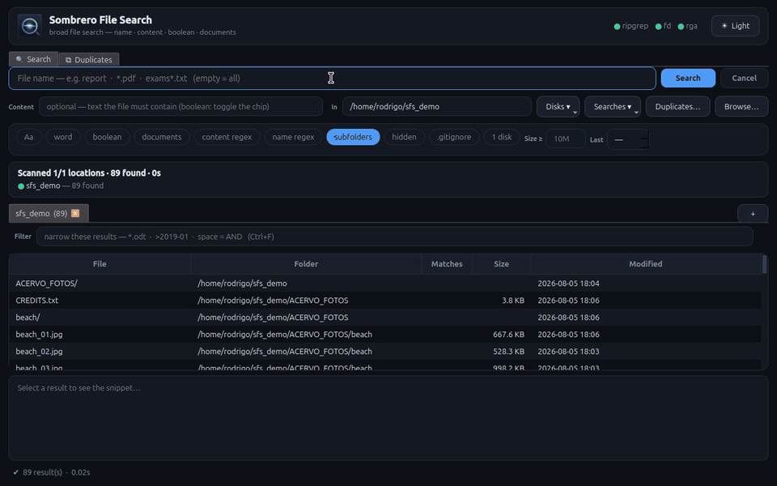

<div align="center">


# Sombrero File Search

**Native file search for Linux — by name, by content, boolean, and inside documents.**
*Live, index-free, and honest: when it could not look somewhere, it says so.*


%20%2B%20Portugu%C3%AAs-informational)

**English** · [Português (BR)](README.pt-BR.md)



<sub>Name → content **inside documents** (PDF/ODT) → boolean expression, live, no index.</sub>

</div>

---

## What it is

An **index-free** file searcher with **live** results, in the spirit of Windows'
*Agent Ransack / FileLocator Pro*, native to Linux and portable across distros. The engines
are **ripgrep** (`rg`) for content and **fd** for names; without them it falls back to pure
Python, so it runs anywhere. The Windows searchers are useless on Linux (they read the NTFS
MFT/USN, which does not exist here); this project reimplements the job natively.

It was built on, and for, a home server with a dozen mechanical disks, SMR drives on USB,
network mounts that sometimes die, and archives of hundreds of thousands of files. Everything
below that sounds like policy was **measured** there, on cold cache, and the numbers are in
this README.

> 📖 **Full manual:** [MANUAL.md](MANUAL.md) (English) · [MANUAL.pt-BR.md](MANUAL.pt-BR.md) (Português) — GUI usage and every CLI option.

## The thesis: honesty over completeness

A search tool has one way to lie that is worse than any bug: returning **"0 results"** when it
never actually looked. A folder that denied reading, a search engine that choked on a flag, a
disk that was not mounted, a NAS that stopped answering, a root that was a typo — every one of
those used to look exactly like *"the file is not there"*. The user concludes the file does not
exist, and that conclusion is wrong.

Sombrero routes **every loss of completeness through a single channel** (`stats['incompleto']`
in the engine). Whatever happens to it downstream is derived from that one channel, so a new
kind of loss added anywhere shows up everywhere for free:

| where | what you see |
|---|---|
| GUI status bar | `⚠ 0 result(s) · ⚠ incomplete: permission denied (×25): directories that denied reading` — the icon turns to **⚠** when the result may be *wrong*, not just short |
| GUI narrative panel | one line per root, live: scanning / done (N found) / **skipped** with the reason (dead mount, folder not found, disk not mounted, not entered by default) |
| CLI stderr | `# incomplete: invalid location in /mnt/naoexiste: path does not exist (disk unmounted? typo?)` plus `#        results are INCOMPLETE — this is not 'nothing was found'` when it is grave |
| `--json` | `{"warn"\|"error": "incomplete", "reason": "<id>", "where": "<path>", "detail": "...", "count": N}` in the same stream as the results |
| exit code | **0** found · **1** nothing found · **2** the result may be wrong — grep-style |

The `reason` identifiers are a contract for scripts (stable, English):

| reason | grave? | meaning |
|---|---|---|
| `permission_denied` | no | directories or files that denied reading |
| `read_error` | no | the engine could not read something (I/O error, not a directory…) |
| `stat_failed` | no | the engine listed or matched a file that vanished before it could be stat'ed |
| `truncated` | no | stopped at the internal result cap; there may be more |
| `snapshots_skipped` | no | a snapshot tree (Timeshift, snapper, ZFS, Samba shadow copies, ostree deployments) was not searched because the live tree already had results for that root — `--snapshots` / "include snapshots" to always search it |
| `snapshots_searched` | no | the live tree gave nothing for that root, so its snapshot trees were searched too; results from them carry `snapshot` |
| `dead_mount` | no | a mount under the search did not answer, or answered broken (ENOTCONN/ESTALE), and was skipped |
| `empty_mountpoint` | no | the root is an empty folder where disks are mounted (`/mnt/X`, `/media/<user>/X`) and is not a mount point — is the disk mounted? |
| `mount_not_entered` | no | a gvfs (phone) or autofs mount under the root was not entered by default; search it by its own path |
| `batch_failed` | no | (boolean) one batch of files could not be read |
| `interrupted` | no | a disk did not answer the cancel in time; its losses were not counted |
| `engine_failed` | **yes** | rg/fd exited with an error (an unsupported flag on an old version, for instance) |
| `engine_missing` | **yes** | rg/fd could not be run; the Python fallback is *not* equivalent (it does not read UTF-16 with BOM) |
| `invalid_root` | **yes** | the root does not exist, or is a file (searches take folders) |
| `not_mounted` | **yes** | the root is listed in `/etc/fstab` and is not mounted — the disk should be there and is not |
| `disk_failed` | **yes** | the worker for one disk crashed |

*Grave* means the result may be **wrong**, not merely incomplete: only grave reasons change the
exit code, so a script doing `sfs ... || echo "not found"` does not start failing because a
system folder denied reading.

This is not a slogan; it is a test. `tests/test_honestidade.py` provokes each loss for real
(chmod 000, an invalid flag injected into the engine's command line, a fake fstab, a root that
is a file…) in **each backend** — fd/name, rg/content, Python/name, Python/content, boolean,
boolean without rg — and demands the right reason in the funnel. **6 backends × 12 losses,
59 applicable cells, all green.** The table is a ratchet in both directions: it fails if a
green cell regresses *and* if a pinned known gap starts working without being un-pinned.

## Disk-aware, and measured

The second thesis is that a search over many disks has to respect what each disk can do.
The rule of the house is *one mechanical head, one process* — and every rule below was
measured on cold cache (`drop_caches`) on a quiesced machine, in September 2026, on the
hardware named. Numbers that were not measured are not in this README.

**Partition by physical disk.** The roots of a search are grouped by the physical disk
behind them (through LVM/LUKS, so btrfs subvolumes and two partitions on the same platter
do not become two processes fighting one head). Each group gets its own `fd`/`rg` process
and its own thread, and results stream in as each disk finishes. On a 10-mount archive:

| | total | when 9 of the 10 disks were done |
|---|---|---|
| single process, 24 threads (before) | 1 094 s | 1 094 s — everything arrived at the end |
| one process per disk + per-class pools (now) | **80 s** | 45 s |

**Thread pool per disk class, and per operation.** The pool of each process follows the
class of the disk (`/sys/block/<disk>/queue/rotational`, resolved through the device mapper)
and whether the search reads *names* or *contents*:

| disk / operation | 1 thread | 4 threads | full pool (24) | policy |
|---|---|---|---|---|
| NVMe, name search (`/usr`, 92 680 hits) | 5.2 s | 1.5 s | **0.5 s** | SSD: full pool |
| SMR 8 TB, **name** search (1.15 M inodes) | **38 s** | — | 48 s | rotational, names: 1 thread |
| SMR 8 TB, **content** search (rg, 25 k files) | 36 s | 30 s | **29 s** | rotational, content: full pool |
| USB HDD, two roots on the same platter (100 k inodes) | 1 process 4.8 s · 2 processes 5.5 s · 2 processes with full pools 6.4 s | | | keep one process per platter |

Name search is metadata, laid out sequentially on the platter: one thread wins and a full
pool costs 21 %. Content search opens every file, and there the disk reorders reads when
several requests are in flight: throttling `rg` only cost 17 %. Throttling the SSD would cost
**12.5×**. A small tree does not tell these policies apart — it takes volume for the head to
start travelling, which is why the first measurement round, on a 175 k-inode disk, showed no
signal at all.

One number worth knowing before you search *contents* in a video archive: the 8 TB SMR disk
above, whole, with one thread, **had not finished after an hour**. Content search on a disk
of large binaries is one seek per file; that is physics, not a bug, and the status bar will be
honest about how far it got.

**Snapshot trees: live first, snapshots only if nothing.** One archive disk hosted five
Timeshift snapshots: 2.4 M inodes against 175 k on the next disk, and it alone took 1 264 s.
Pruning them gives **95 s, identical results, 13.3× faster** — but a file searcher that returns
nothing for a file that *is* on the disk, inside a snapshot, is lying. So the live tree is
searched first, and for every root you typed that came back empty the search **extends itself**
to the snapshot trees pruned under it (Timeshift, snapper, ZFS, Samba shadow copies, ostree
deployments — one mechanism for all of them, nothing keyed on the distro's name). Results from
there are marked (`snapshot` in `--json` and in the CSV, a tooltip in the GUI), and identical
copies collapse into one row: same inode, or same relative path + size + mtime between the live
tree and a snapshot, live copy first, "+N copies" on the row. `--snapshots` / "include
snapshots" extends without waiting for zero; pointing the search *into* a snapshot searches it
outright — that is where you wanted to look. Both outcomes are *said*: `snapshots_skipped` when
the live tree had results, `snapshots_searched` when the extension ran. Measured on a Timeshift
disk (5 rsync snapshots, 788 k inodes): live name search 0.11 s; the extension by name adds
≈9 s; by **content** it costs ≈2.7 min, because `rg` reads every hard link once per snapshot.
The ostree object store (`ostree/repo`) is never searched: its files are named by hash.

## Mounts, dead and alive

Searching `/` or `/mnt` means *everything that lives under it*, network and local disks
alike. Every mount under a root becomes a root of its own, goes through the gate one by one,
gets its own process, and the parent walks with `--one-file-system` so nothing is visited
twice. Kernel pseudo-filesystems (`/proc`, `/sys`, `/dev`…) are left out with a note; a bind
mount of the same filesystem is not walked twice; `--one-fs` on the CLI (or "1 disk" in the
GUI) turns the expansion off, because then you asked for one folder.

**The gate.** An NFS hard mount whose server is down freezes `stat()` in uninterruptible
D state — not even `kill` helps. Before any engine descends into a mount, Sombrero probes it
from a **throwaway child process** with a timeout (a stuck thread would keep the whole
program from exiting; a stuck child is reparented to init and abandoned). A mount that does
not answer, or answers broken, is skipped with a visible line — and it is **excluded from
every engine's command line**, because with `--one-file-system` the walker still has to
`stat()` the mount point to compare devices, and that is exactly the call that hangs. Each
engine anchors the exclusion in its own way, measured: `fd --exclude '/rel'` anchors on the
first root of the process (so a root with a dead mount beneath gets a process of its own);
`rg` only anchors `!**/absolute/path`; the Python walker prunes by path.

**Empty mount points.** The most realistic "disk not mounted" case is a folder that *exists*
and is empty. If it is declared in `/etc/fstab`, that is a fact (`not_mounted`, grave). If it
merely sits where disks are mounted, that is a hint (`empty_mountpoint`, not grave): the
search goes on, and the bar asks whether the disk is mounted.

`gvfs` (phones, cameras) and `autofs` triggers stay **out** of "search everywhere" — waking
every automount in the house is not what you meant — but the funnel says so, with the path
to search explicitly.

## Features

- 🔎 **Name + content** — glob (`*.py`) or regex, plain text or regex, highlighted in the preview.
- 🧩 **Boolean search** — `(note OR report) AND patient NOT draft`; also `| & !` and `"quoted phrases"`.
  Precedence `NOT > AND > OR`, parentheses. `AND` narrows the second term to the files the first
  one found; independent `OR` terms run in parallel (`LFS_WORKERS`, default 3).
- 📄 **Inside documents** — PDF, docx, epub, odt, zip via [ripgrep-all](https://github.com/phiresky/ripgrep-all) (optional).
- 🎬 **Media preview** — thumbnails and an audio/video player with transport controls.
- 🗂️ **Search tabs, saved searches, history, export** to CSV/JSON, light/dark theme.
- 📁 **Copy files** — never moves or deletes the source; destination pre-flight (free space,
  FAT32 limits, illegal names per filesystem) and **paced writes** to removable and network
  media so a 300 GB copy does not swallow the system's page cache.
- 🔁 **Duplicate finder** — finds, shows and exports byte-identical groups. **Never deletes.**
  Deciding which copy dies belongs to the human, in their file manager, with the paths in front
  of them; a delete button would be the end of that argument.
- 💻 **Matching CLI** — same engine, `--print0` for pipelines, `--json` for automation,
  `--nice-io` for cron on a busy server, `--index` (name only) to lean on `plocate` when you
  explicitly ask — it refuses when the index has holes, and every hit is verified live.

## Installation

| | when to use | GUI? |
|---|---|---|
| **AppImage** | any distro, nothing to install | yes — Python, PySide6, `rg` and `fd` bundled |
| **.deb** | Debian/Ubuntu/Mint | needs PySide6 (`sombrero-file-search --setup-gui` builds a venv in your home) |
| **install.sh** | any distro, installs into `~/.local`, no root, immutable distros included | yes |

```bash
# AppImage
chmod +x Sombrero_File_Search-*.AppImage && ./Sombrero_File_Search-*.AppImage
./Sombrero_File_Search-*.AppImage --cli ~/docs -n '*.pdf'    # the very same CLI

# .deb
sudo apt install ./sombrero-file-search_*_all.deb

# from source
git clone https://github.com/Thiopental1976/sombrero-file-search.git
cd sombrero-file-search && ./install.sh
```

The `.deb` is deliberately thin: `Depends: python3`, with `ripgrep` and `fd-find` as
*Recommends* — there is a pure-Python fallback, so declaring them mandatory would be a lie.
The GUI needs PySide6 and, on minimal installs (cloud images, containers), `libgl1`: Qt loads
`libGL.so.1` even off-screen, and without it `import PySide6` fails. `--setup-gui` and
`install.sh` say so when it is missing.
There is no Flatpak on purpose: this program exists to sweep the whole disk, and the sandbox is
the wrong model for that.

## CLI

```bash
sfs ~/projects -n '*.py' -c "def main"        # name + content   (lfs is an alias)
sfs ~/docs -c report --docs                   # inside PDF/docx/epub
sfs ~/notes -b '(note OR report) AND patient' # boolean
sfs /data -c error -l --print0 | xargs -0 …   # pipeline
sfs /mnt -n '*.iso' --json                    # NDJSON, one object per match + warnings
sfs / -n laudo --snapshots                    # include snapshot trees
```

`--json` emits one object per match (`path`, `size`, `mtime`, `is_dir`, `nmatch`, `lines[]`,
`snapshot` — the pruned tree it came from, `null` for the live tree — and `copies[]`, the
identical copies collapsed into it so far), `{"copy": path, "of": owner, "snapshot": tree}` for
a duplicate absorbed after its owner was already printed, and, in the same stream,
`{"warn":"incomplete",…}` / `{"error":"incomplete",…}` with the
`reason` table above, `{"warn":"mount_dead",…}`, `{"warn":"denied",…}`, and
`{"error":"boolean_expression",…}` for a malformed expression. Exit code: 0 / 1 / 2.

## `rg` ↔ Python fallback parity

The fallback returns the same result as ripgrep in the overwhelming majority of cases; the
parity harness runs 500 random boolean expressions × 2 000 files and demands zero divergence.
The differences that exist are documented on purpose and pinned by tests: `nmatch` counts
occurrences with `rg` and matching lines in the fallback; UTF-16/UTF-32 with BOM is found by
`rg` only (hence `engine_missing` is grave); a lone CR outside CRLF segments lines differently
(pre-OS X files, not chased). CRLF is normalized on both sides.

## Architecture

```
lfs/engine.py     # Qt-free core: Query/Match, rg (content) / fd (name) backends, Python fallback,
                  # the completeness funnel, the mount gate, root expansion, per-disk partitioning
lfs/boolean.py    # boolean search: tokenizer → AST → file sets, same funnel and gate
lfs/disks.py      # facts about disks and mounts: class, rotational, fstab, liveness probe, caps
lfs/dupes.py      # duplicate finder (own code; no removal feature, nor should it ever gain one)
lfs/indexed.py    # --index: plocate with coverage checks and live verification
lfs/app.py        # PySide6 GUI: form, live table, narrative panel, preview, copy, duplicates
lfs/cli.py        # CLI (same core)
lfs/fileops.py    # non-destructive copy: never moves, renames or deletes
lfs/i18n.py       # English is the source; pt-BR is a table keyed by the English string
tests/            # test_audit.py (125 tests), test_honestidade.py (the table),
                  # test_parity_rg_python.py, test_paralelo_por_disco.py, test_topologias.py…
```

```bash
python3 tests/test_audit.py          # ~1 min; GUI tests need PySide6 (offscreen)
python3 tests/test_honestidade.py    # the honesty table, ~1 min
./packaging/build_deb.sh             # ~3 s
./packaging/build_appimage.sh        # ~10 min the first time
```

## Interface language

English is the source language; the GUI follows the system locale and falls back to English
for any locale that is not Portuguese. The CLI is English-only. `SFS_LANG=en|pt` forces it.

## License

**GNU GPL v3 or later** ([LICENSE](LICENSE)) — `SPDX-License-Identifier: GPL-3.0-or-later`.
Copyright (C) 2026 Rodrigo Toledo. Distributed WITHOUT ANY WARRANTY.
